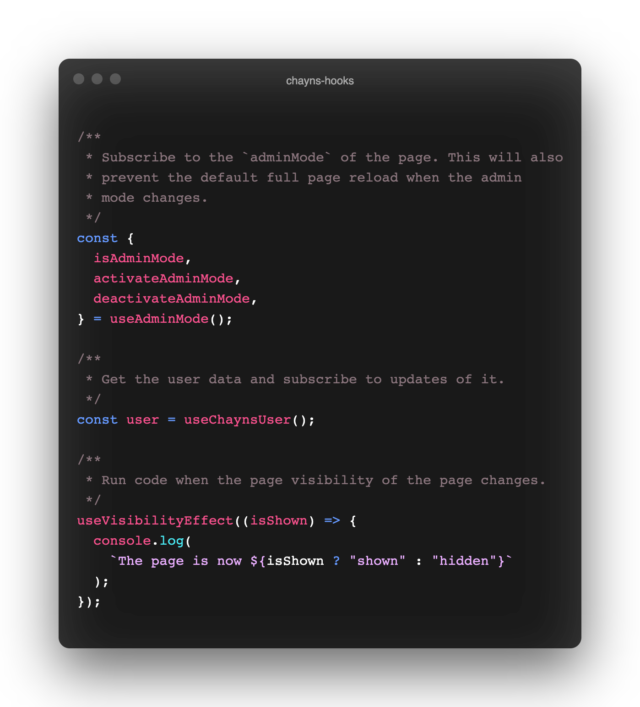

<h1 align="center">chayns-hooks</h1>
<p align="center">
    <strong>A collection of React hooks for <a href="https://chayns.net/">chayns®</a> developers.</strong>
</p>
<p align="center">
    <a href="https://github.com/leodr/chayns-hooks/blob/main/LICENSE">
        
    </a>
    <a href="https://github.com/leodr/chayns-hooks/blob/main/package.json">
        
    </a>
    <a href="https://github.com/leodr/chayns-hooks/issues">
        
    </a>
</p>
<p align="center">
    <a href="#-documentation"><b>Documentation</b></a>
    <span>  •  </span>
    <a href="#-development"><b>Development</b></a>
    <span>  •  </span>
    <a href="#-contribute"><b>Contribute</b></a>
</p>

---

`chayns-hooks` packs some of the functionality of the
[`chayns-js`](https://github.com/TobitSoftware/chayns-js) library as React hooks
for easier use in React components.

Contrary to `chayns-js`, this library is also fully typed.

<p align="center">
    
</p>

<br />

## ❯ Documentation

- [`useAdminMode`](#useadminmode)
- [`useChaynsUser`](#usechaynsuser)
- [`useVisibilityEffect`](#usevisibilityeffect)

<br>

### `useAdminMode`

Returns wether the user is currently in admin mode, aswell as methods to toggle
the admin mode from your application code.

> By default any iframe on a page will be reloaded when the admin mode value
> switches. This hook will register a `chayns.addAdminSwitchListener`, which
> will prevent the default behavior. You will get the updated value in the
> `isAdminMode` field and your page will not reload.

#### Example

```ts
const { isAdminMode, activateAdminMode, deactivateAdminMode } = useAdminMode();
```

#### Return values

- **`isAdminMode`: `boolean`**

  Wether the user is currently in admin mode.

- **`activateAdminMode`: `() => void`**

  A function to activate admin mode. You will receive the updated value in
  `isAdminMode`.

- **`deactivateAdminMode`: `() => void`**

  A function to deactivate admin mode. You will receive the updated value in
  `isAdminMode`.

<br>

### `useChaynsUser`

Returns the user object of the currently logged in user and subscribes to any
changes to it, including logging in or out.

> By default any iframe on a page will be reloaded when a user logs in or out.
> This hook will register a `chayns.addAccessTokenChangeListener`, which will
> prevent the default behavior. You will get the updated value in the `user`
> field and your page will not reload.

#### Example

```ts
const user = useChaynsUser();
```

#### Return value

- **`user`**

  The
  [user object](https://github.com/TobitSoftware/chayns-js/wiki/Environmental-Variables#chaynsenvuser)
  of the currently logged in user.

<br>

### `useVisibilityEffect`

This hook allows you to run any side-effect when the visibility of the page
changes. Use it similar to a `useEffect`, but without a dependency array.

#### Example

```ts
useVisibilityEffect((isShown: boolean) => {
  console.log(`The page is now ${isShown ? "shown" : "hidden"}`);
});
```

#### Callback arguments

- **`isShown`**

  Indicates wether the page is now hidden (`false`) or shown (`true`).

<br>

## ❯ Development

For developing you have to link the project to a React application using
[`yarn link`](https://classic.yarnpkg.com/en/docs/cli/link/).

### Releasing a new version on NPM

To release a new version on npm, run `npm version (patch|minor|major)` to
increase the version. This will create a Git tag for you.

Push this Git tag to GitHub and a GitHub Action will publish the package for
you.

<br>

## ❯ Contribute

If you think you have any ideas that could benefit the project, feel free to
create an issue or pull request!

<br>

---

<p align="center">
    <sub>
        Project by Leo Driesch, released under <a href="https://github.com/leodr/chayns-hooks/blob/main/LICENSE">MIT license</a>.
    </sub>
</p>
<p align="center">
    <a href="https://twitter.com/leodriesch">
        
    </a>
    &nbsp;&nbsp;
    <a href="https://github.com/leodr">
        
    </a>
</p>
